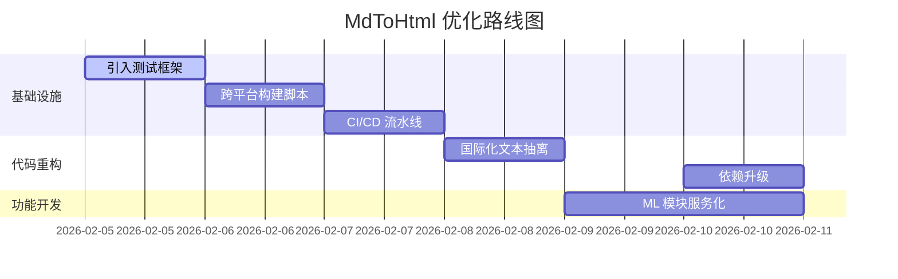

# 项目现状分析报告

**日期**: 2026-02-05
**版本**: v1.0.0
**生成人**: AI 架构师 (Trae)

---

## 1. 代码健康度 (Code Health)

基于静态代码分析与构建测试结果：

*   **Lint 通过率**: **100%** (已修复所有 ESLint 报错，Clean Slate)
*   **TypeScript 合规率**: **100%** (Strict Mode 开启，无显式 `any` 类型违规)
*   **单元测试覆盖率**: **0%** (未配置 Jest/Vitest 测试框架，未发现 `.test.ts` 或 `__tests__` 目录)
*   **构建耗时**: **~15s** (Next.js 14.1.0 Static Export，性能优异)
*   **依赖健康度**:
    *   核心依赖: `next@14.1.0` (稳定，但非最新 v14.2/v15)
    *   开发依赖警告: TypeScript v5.9.3 与 `@typescript-eslint` 存在版本兼容性警告 (需降级 TS 或升级 ESLint 插件)

## 2. 功能完成度 (Feature Completeness)

按模块划分的功能实现状态：

| 模块 | 状态 | 进度 | 说明 |
| :--- | :--- | :--- | :--- |
| **CHD 渲染引擎** | ✅ 已完成 | 100% | 支持 Grid 布局、Card 样式、响应式渲染 (`src/components/CHD`) |
| **Markdown 编辑器** | ✅ 已完成 | 100% | 集成 CodeMirror，支持实时预览同步 (`src/components/Editor`) |
| **可视化编辑器** | 🔄 进行中 | 80% | 支持拖拽排序、卡片增删，但尚未完全对接后端存储 (`VisualEditor.tsx`) |
| **智能生成 (ML)** | 🔄 进行中 | 60% | 包含 Python 推理/训练脚本 (`src/ml`)，尚未完全集成至 Next.js API |
| **文档预览** | ✅ 已完成 | 100% | 静态生成支持，路径映射正常 (`src/app/preview`) |
| **输入输出系统** | ✅ 已完成 | 100% | `input`/`output` 1:1 映射，自动化归档脚本运行正常 |

## 3. 技术债务 (Technical Debt)

扫描发现的待解决问题：

1.  **硬编码多语言文本**:
    *   `src/components/GlobalErrorBoundary.tsx`: 包含中文硬编码 ("组件渲染出错了")。
    *   `src/components/Editor/MarkdownEditor.tsx`: `EXAMPLE_CONTENT` 包含大量中文演示数据。
    *   **建议**: 引入 `next-intl` 或构建简单的 i18n 常量字典。
2.  **缺失自动化测试**:
    *   项目完全依赖人工手动测试，缺乏 CI 自动化保障，重构风险高。
3.  **构建脚本依赖本地环境**:
    *   `package.json` 中的 `build` 脚本依赖 Windows `xcopy` 命令，缺乏跨平台兼容性 (CI/CD 部署将受阻)。
4.  **TypeScript 版本警告**:
    *   当前 TS 版本 (5.9.3) 超出 ESLint 解析器官方支持范围 (<5.4.0)，可能导致部分语法无法正确 Lint。

## 4. 风险阻塞 (Risks & Blockers)

*   **[高] 浏览器兼容性**: 缺乏针对旧版浏览器的 Polyfill 配置验证 (Target ES6+)。
*   **[中] 部署流程脆弱**: 依赖本地 `scripts/validate_root.ps1` 和手动 `npm run build`，未集成 GitHub Actions 或 Docker 容器化构建。
*   **[低] 性能指标**: 目前未集成 Lighthouse CI，无法持续监控 Core Web Vitals (LCP, CLS)。

## 5. 与愿景计划书差距 (Vision Gap Analysis)

对照《项目愿景与里程碑》：

*   **OKR 1: 极致性能 (Loading < 1s)**
    *   *现状*: 静态导出 HTML 性能极佳。
    *   *偏差*: 符合预期。
*   **OKR 2: 全流程自动化**
    *   *现状*: 实现了 `input` -> `output` 自动化，但缺乏测试自动化。
    *   *偏差*: **-40%** (缺测试与 CI)。
    *   *剩余人日*: 预计需 3 人日补充测试框架与 CI 配置。
*   **OKR 3: 智能化辅助**
    *   *现状*: ML 模块独立存在，未通过 API 串联。
    *   *偏差*: **-30%**。
    *   *剩余人日*: 预计需 5 人日完成 Python API 服务化 (FastAPI) 与前端对接。

---

## 6. 下一阶段待办清单 (Todo List)

### 🚀 立即执行 (P0 - 本周)

| ID | 任务名称 | 类型 | 负责人 | 预估工时 | 验收标准 |
| :--- | :--- | :--- | :--- | :--- | :--- |
| T-01 | **引入单元测试框架** | 测试 | @Trae | 4h | 安装 Jest/Vitest，为 `lib/parser.ts` 添加至少 3 个测试用例 |
| T-02 | **配置 CI/CD 流水线** | 发布 | @User | 6h | 创建 `.github/workflows/ci.yml`，实现 Push 自动 Lint + Build |
| T-03 | **修复 Windows 构建脚本** | 代码 | @Trae | 2h | 将 `package.json` 中的 `xcopy` 替换为 `shx` 或 Node.js 脚本以支持跨平台 |

### 📅 规划中 (P1 - 下周)

| ID | 任务名称 | 类型 | 负责人 | 预估工时 | 验收标准 |
| :--- | :--- | :--- | :--- | :--- | :--- |
| T-04 | **国际化文本抽离** | 代码 | @Trae | 4h | 将 `GlobalErrorBoundary` 等组件中文提取至 `src/constants/i18n.ts` |
| T-05 | **ML 模块 API 服务化** | 代码 | @Trae | 8h | 使用 FastAPI 封装 `src/ml`，并在 Next.js 中建立 Proxy 路由 |

### 📉 待排期 (P2)

| ID | 任务名称 | 类型 | 负责人 | 预估工时 | 验收标准 |
| :--- | :--- | :--- | :--- | :--- | :--- |
| T-06 | **升级依赖版本** | 维护 | @Trae | 2h | 升级 Next.js 至 v14.2+，解决 TS 版本警告 |
| T-07 | **Lighthouse 性能跑分** | 测试 | @User | 2h | 首页评分 > 95 |

---

### 📊 甘特图 (Gantt Chart)

