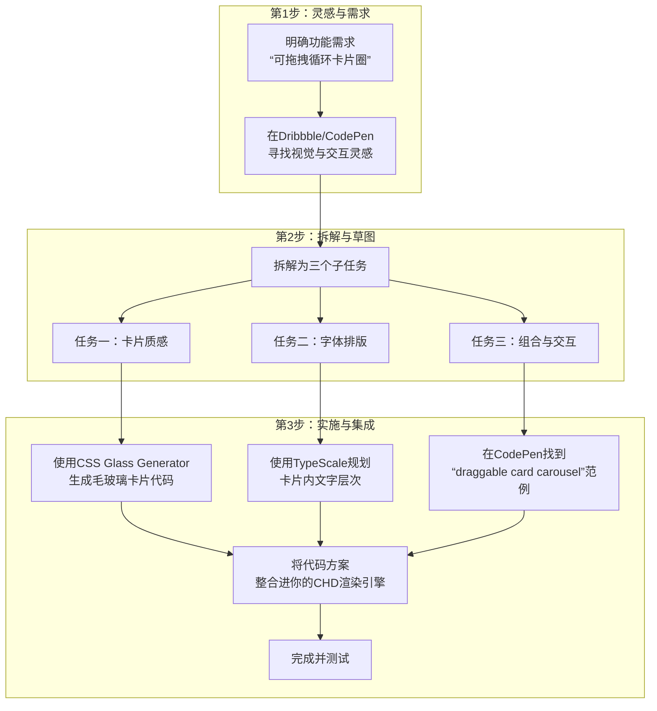

# 前端样式提升方案与资源整合报告

**版本**: 1.0
**日期**: 2026-02-04
**状态**: 已归档

---

## 1. 核心目标

本方案旨在提升 CHD 文档渲染系统的视觉表现，从“能用”升级为“专业”与“精美”。通过引入轻量级框架和系统化的设计资源，实现卡片质感、字体系统与交互体验的全面升级。

## 2. 技术选型：Pico.css

**Pico.css** 被选定为基础样式框架，理由如下：

1.  **无缝集成**：只需引入 CDN 链接，即可自动美化基础 HTML 元素（排版、字体、按钮），无需复杂的构建流程。
2.  **契合理念**：强调语义化 HTML，与 CHD 协议的内容结构定义高度一致。
3.  **进阶灵活**：提供整洁的底座，方便叠加自定义 CSS（如“亮点”卡片）或集成其他组件库。

## 3. 三大维度提升路径

针对 **卡片质感**、**字体系统**、**容器交互** 三个核心维度，制定以下学习路径与资源库：

| 关注维度 | 核心知识与概念 | 推荐资源/工具 | 产出物 |
| :--- | :--- | :--- | :--- |
| **1. 卡片质感与材质** | `background` (渐变/图片), `backdrop-filter` (毛玻璃), `box-shadow` (多层阴影), 玻璃态/新拟态 | 1. **CSS Glass Generator** (毛玻璃) 2. **Box-shadow.dev** (复杂阴影) 3. **Dribbble / Behance** (UI Cards 灵感) | 可复用的 CSS 代码片段，顶级视觉参考 |
| **2. 字体系统与排版** | `font` 系列, `line-height`, `letter-spacing`, 对比度, 字体配对, 视觉引导 | 1. **TypeScale.com** (字号比例尺) 2. **FontPair** (字体搭配) 3. **Refactoring UI** (实战细节) | 科学的字号搭配方案，字体组合建议 |
| **3. 容器组合与交互** | Flexbox, Grid, `object-fit`, `transition`, `transform`, 拖拽库 | 1. **CSS Grid Generator** (网格布局) 2. **CodePen** (搜索 card layout/interactive) 3. **Tailwind CSS** 组件库 | 可交互的布局原型，完整交互代码 |

## 4. 实践示例：可拖拽循环卡片圈

针对“展示多个亮点”的需求，开发思路如下：

## 5. 资源获取与集成策略

### 5.1 高效资源清单

| 任务维度 | 搜索关键词/网站 | 直接获取内容 |
| :--- | :--- | :--- |
| **卡片质感** | `glassmorphism CSS generator`, `neumorphism generator` **CSS Glass Generator**, **Box-shadow.dev** | 完整的 CSS 代码（背景、模糊、阴影），即拷即用 |
| **字体排版** | `type scale generator`, `font pairing tool` **TypeScale.com**, **Google Fonts** | 协调的字号阶梯规则（h1-p 的大小/行高） |
| **组合交互** | `card layout CSS Grid codepen`, `draggable card carousel` **CodePen**, **CSS Grid Generator** | 完整的 HTML/CSS/JS 交互原型 |

### 5.2 实操步骤

1.  **卡片质感**：使用 [css.glass](https://css.glass) 调整参数，复制 CSS 应用于卡片容器。
2.  **字体排版**：使用 [type-scale.com](https://type-scale.com) 生成 CSS 规则，统一标题与正文样式。
3.  **组合交互**：在 [codepen.io](https://codepen.io) 搜索 `draggable card carousel`，Fork 代码并集成。

## 6. 核心建议

**“首席架构师”与“资源整合者”**

不要从零手写所有样式。利用上述工具生成高质量的“样式原子”（质感、字体、动画），将其模块化封装为 CHD 渲染引擎的可配置规则（如通过 `style` 或 `layout` 字段调用）。建立个人的“组件实验室” HTML 文件，用于快速测试和积累样式代码。
