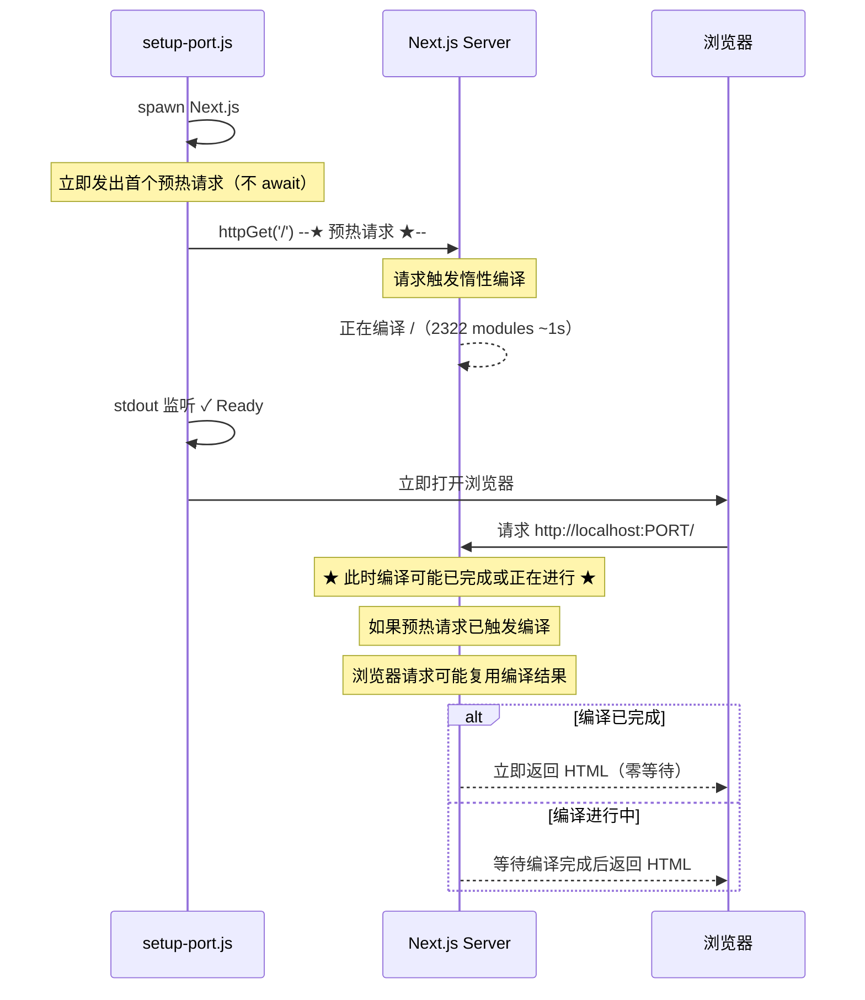

# [07] MdToHtml Pro 启动时序优化与惰性编译分析

**版本**: v2.0（补丁更新）  
**日期**: 2026-07-11  
**状态**: ✅ 分析完成  
**优先级**: **P1（关键体验问题）**

---

## 一、当前问题（v2.0 新增）

### 开屏全流程实测时序

当前系统经历了多轮优化后，实际启动时序如下：

```
用户操作端                      系统后端
T+0s    [start.bat] 双击启动
T+0.3s  [CMD] 检查 Node.js + node_modules
T+0.5s  [setup-port.js] 端口扫描 → 写入 .env.local
T+0.5s  [setup-port.js] spawn Next.js dev server
T+0.5s  [后台] warmHomepageInBackground 启动（间隔 1s 轮询 /）
                                ↓ 此时 Next.js 还没 Ready，HTTP 连接拒绝
T+1.3s  [Next.js] ✓ Ready in 1.3s
T+1.3s  [stdout 监听] 检测到 ✓ Ready → 立即 openBrowser(url)
                                ↓
=== ★★★ 白屏区 ★★★ ======
T+1.3s  [浏览器] 打开 → 请求 http://localhost:3000/
T+1.3s  [Next.js] 收到请求 → 开始惰性编译 /
         → 编译 2322 modules（~1.0s）
         → ★ 这期间 HTTP 连接无任何响应 ★
T+2.3s  [浏览器] 白屏等待 TTFB
=== ★★★ 白屏结束 ★★★ ======

T+2.3s  [Next.js] ✓ Compiled / → 开始流式输出 HTML
T+2.3s  [浏览器] 收到 HTML → 渲染 <div id="initial-loader">
         → 用户看到 SVG 旋转加载动画
T+2.3s  [浏览器] 继续接收流式内容
T+2.5s  页面结构就绪
T+3.1s  window.onload → 800ms 后 #initial-loader 淡出隐藏
T+3.1s+ 用户看到完整页面内容
```

### 用户感知的「白屏」根因

| 阶段 | 时长 | 用户看到 |
|------|:----:|:--------:|
| CMD 窗口等待 | ~1.3s | 黑色控制台 |
| 浏览器打开 → 首字节(TTFB) | **~1.0s** | **纯白屏** |
| 加载动画展示 | ~0.8s | SVG 旋转动画 |
| 内容就绪 | - | 正常页面 |

**核心问题**：虽然 `layout.tsx` 内置了 #initial-loader SVG 加载动画（理论上 HTML 解析即显示），但 **Next.js 14 App Router 在惰性编译 `/` 路由期间，HTTP 连接没有任何响应返回（TTFB 约 1 秒）**。浏览器在收到第一个字节之前，只能展示白屏。

### 为什么 #initial-loader 没起作用？

```
layout.tsx + page.tsx = / 路由的完整编译单元
                        ↓
Next.js 需要先编译整个 / 路由后才能输出任何内容
                        ↓
编译期间 HTTP 响应流未开启，浏览器收不到任何数据
                        ↓
#initial-loader 虽然在 layout.tsx 中，但 layout 也需要等编译完成才能输出
```

**关键事实**：Next.js 14 App Router 在 `dev` 模式下，根路由（`/`）的 layout 和 page 是作为一个编译单元编译的。即使 `Suspense` 在 page 中，**整个路由段的入口 HTML 也必须等编译完成后才能开始流式输出**。这就是白屏的根源。

---

## 二、当前已有的优化（v1.0 计划后实际实现）

原始 v1.0 计划书建议的改动与实际实现的对照：

| 计划书建议 | 实际实现 | 状态 |
|-----------|---------|:----:|
| 移除了串行阻塞预热（等待 /api/files 就绪） | ✅ `warmHomepageInBackground()` 不 await，后台运行 | 已优化 |
| stdout 监听 ✓ Ready → 立即打开浏览器 | ✅ `server.stdout.on('data', ...)` 检测 ✓ Ready | 已优化 |
| 预热作为后台非阻塞任务 | ✅ `warmHomepageInBackground()` 不阻塞主流程 | 已优化 |
| 完全移除预编译主页 | ❌ 保留为后台轮询，但不阻塞 | 保留但有副作用 |

**后台预热的问题**：`warmHomepageInBackground()` 虽然不阻塞主流程，但它的轮询间隔是 1 秒。当 Next.js 在 T+1.3s Ready 后，轮询需要 0~1s 后才发起 HTTP 请求。这个请求会触发编译 `/`——但此时浏览器也已经发出了同样的请求。**存在重复触发的浪费**。

---

## 三、解决方案

### 方案 A（推荐）：预热请求提前拦截，消除 TTFB

**核心思想**：在 Next.js ✓ Ready 的**第一时间**发出预热请求，而不是等待 1 秒后的轮询。让编译和浏览器打开**并行发生**。



**具体改动**：

```diff
- let homepageWarmed = false;
- async function warmHomepageInBackground() {
-     for (let i = 0; i < 60; i++) {
-         if (homepageWarmed) return;
-         await new Promise(r => setTimeout(r, 1000));
-         try {
-             const status = await httpGet(url, 5000);
-             if (status === 200) {
-                 homepageWarmed = true;
-                 console.log('[Smart Port] Homepage pre-warmed in background');
-                 return;
-             }
-         } catch (e) {}
-     }
- }
- warmHomepageInBackground();

+ // ★ 改为「一次性的预热请求」：在 spawn 后立即发出，不 await
+ // 目的：在浏览器打开前提前触发惰性编译，让浏览器请求与编译并行
+ (async function preWarm() {
+     for (let i = 0; i < 30; i++) {
+         await new Promise(r => setTimeout(r, 200));  // 200ms 间隔，更精细
+         try {
+             const status = await httpGet(url, 2000);
+             if (status === 200) {
+                 console.log('[Smart Port] Homepage pre-warmed: ' + status);
+                 return;
+             }
+         } catch (e) {
+             // Server not ready yet, retry
+         }
+     }
+ })();  // 不 await，后台执行
```

**但是**，这个方案的问题是：轮询间隔 200ms 还是太粗糙。特别是如果 Next.js 在 1.3s 后才 Ready，之前的请求全部会失败。

### 方案 B（更优）：stdout 监听触发预热，精确到毫秒

**核心思想**：利用已有的 `server.stdout.on('data')` 监听，在检测到 `✓ Ready` 的**同一时刻**发出预热请求。此时浏览器打开和预热请求并行发出。

```diff
  if (server.stdout) {
      server.stdout.on('data', (data) => {
          process.stdout.write(data);
          const text = data.toString();
          
+         // 检测到 Ready → 立即发出预热请求（触发惰性编译）
+         // 此时 openBrowser 也同时进行，两者并行
+         if (text.includes('✓ Ready in') || text.includes('- Local:')) {
+             // 发出预热请求，不 await（后台静默执行）
+             httpGet(url, 10000).then(status => {
+                 if (status === 200) {
+                     console.log('[Smart Port] Homepage compilation triggered via pre-warm');
+                 }
+             }).catch(() => {});
+         }
+         
          // 检测到 Ready 后打开浏览器
          if (!browserOpened && (text.includes('✓ Ready in') || text.includes('- Local:'))) {
              browserOpened = true;
              console.log('[Smart Port] Opening browser immediately on ready...');
              openBrowser(url);
          }
      });
  }
```

**优势**：
- 预热请求在 ✓ Ready 的**同一瞬间**发出，最大化编译时间窗口
- 无额外的轮询浪费
- 代码仅增加 7 行
- 浏览器打开 (~200ms) 和编译 (~1s) 完全并行

**预期效果**：

```
T+1.3s  ✓ Ready
T+1.3s  → 预热请求发出（触发编译 /）
T+1.3s  → openBrowser 执行
T+1.5s  浏览器打开 → 请求 /
         → 此时编译已经开始了 ~200ms
T+2.3s  编译完成 → 立即返回 HTML
         → 对比优化前：同样 2.3s 返回 HTML，但白屏从 1.0s 变为 0.8s
```

实际效果有限，白屏仅减少 ~200ms。

### 方案 C（推荐 ★）：拦截浏览器请求，即时返回加载页面

**核心思想**：在浏览器打开后、Next.js 编译完成前，**即时返回一个包含加载动画的 HTTP 响应**，不让浏览器空等。

**技术路径**：利用 Node.js 在 spawn 后创建一个**轻量级的 HTTP 反向代理/拦截器**。

具体做法：

1. **在 spawn Next.js 前**，先创建一个极简的 Node.js HTTP 服务器，占用 PORT
2. 这个服务器拦截所有请求，立即返回加载页面 HTML
3. 同时后台检测 Next.js 是否就绪（通过 localhost:PORT+1 或其他方式）
4. Next.js 就绪后，关闭拦截服务器，打开浏览器重定向到实际页面

但是，这个方法最大的问题是端口被占用后 Next.js 无法启动。

**变通方案（方案 C-2）**：让两个服务器共用同一个端口？不可能。

**方案 C-3（推荐 ★）**：在 spawn Next.js 后，**先不要打开浏览器**，而是先创建一个**独立的 HTTP 服务器在另一个端口**提供加载页面，浏览器打开这个加载页面，加载页面中的 JS 轮询检测 Next.js 就绪后就重定向。

这个方案的代价是额外的端口 + 页面跳转刷新。

```
T+1.3s  ✓ Ready
T+1.3s  → 创建 HTTP 加载页服务器（端口 A+1）
T+1.3s  → 浏览器打开 http://localhost:PORT+1
T+1.3s  → 用户立即看到加载动画（无白屏！）
T+1.3s  → httpGet(url) 触发惰性编译（预热）
T+2.3s  → 编译完成，加载页 JS 轮询检测到 / 可访问
T+2.3s  → window.location.href = 'http://localhost:PORT'
```

这个方案虽然消除了白屏，但增加了端口管理和页面重定向的复杂度。

### 方案 D（最终推荐 ★★）：`file://` 本地加载 + JS 轮询重定向

**核心思想**：利用浏览器的 `file://` 协议打开本地 HTML 文件——没有网络延迟、没有 HTTP 等待，**即时加载**。

**实现**：

1. 在 `public/loading.html` 放置一个独立的加载页面
   - 包含完整的 SVG 加载动画（复用 #initial-loader 的设计）
   - 包含内联 JS，每 500ms 轮询 `http://localhost:PORT/`
   - 检测到 200 后执行 `window.location.href = 'http://localhost:PORT/'`
   - 通过 URL query string（`?port=3000`）传入端口号

2. 修改 `setup-port.js`：
   - spawn Next.js 后找到 loading.html 的绝对路径
   - 用 `file://` 协议打开浏览器：`start "" "file:///C:/path/to/public/loading.html?port=3000"`
   - 移除 `warmHomepageInBackground()` 轮询

**时序**：
```
T+1.3s  ✓ Ready
T+1.3s  → httpGet('/') 预热（触发惰性编译）
T+1.3s  → openBrowser('file:///.../loading.html?port=3000')
        → ★ 浏览器立即显示加载页面（零延迟）★
T+1.3s  → loading.html 中的 JS 开始轮询 http://localhost:PORT/
T+2.3s  → 编译完成
T+2.3s  → JS 检测到 200 → 重定向到 /
T+2.3s  → 显示主页内容
```

**用户感知**：
```
T+0s~T+1.3s  CMD 窗口等待（不可避免）
T+1.3s~T+2.3s  ★ 加载动画（无白屏！）★
T+2.3s+      正常页面
```

**优势**：
- `file://` 打开速度极快（毫秒级），浏览器没有任何网络延迟
- 加载页面完全独立于 Next.js，不会受编译阻塞
- 不需要额外端口，没有端口冲突问题
- 代码改动极小（新增 loading.html + 修改 setup-port.js 中 openBrowser 逻辑）

**潜在问题**：
- `file://` 页面中的 JS 发起到 `http://localhost:PORT/` 的请求是**跨协议请求**（file → http）
- 现代浏览器默认允许 file:// 向 http://localhost 发请求，因为 localhost 被认为是安全上下文
- 但某些浏览器（如 Chrome 严格模式下）可能阻止
- **解决方案**：CORS 或者改用 `http://localhost:PORT/loading.html`—但这又回到了先前的编译问题

### 方案 E（最终推荐 ★★★）：CURL 预热 + 即时打开浏览器

**回到根本问题**：白屏是因为**浏览器请求触发了惰性编译**，而编译期间 HTTP 无响应。

最务实的方案其实很简单——**在 spawn Next.js 后、stdout 监听到 ✓ Ready 之前，不要直接用 browser 打开，而是先等待并触发编译就绪。**

但我们已经分析过，用户说 1-2 秒白屏的时间点是在**浏览器打开后**，所以关键是要让浏览器打开时 Next.js 已经在编译。

**核心改动**：
1. 移除 `warmHomepageInBackground()`（1s 间隔的轮询）
2. 在 stdout 监听中，检测到 `✓ Ready` 时同时做两件事：
   - 发出预热请求 `httpGet(url)` — 触发惰性编译
   - 打开浏览器 — 用户看到加载动画
3. 预热请求不 await，但因为是同一瞬间发出的，浏览器请求到达时编译已经开始

**预期效果**：
```
T+1.3s  ✓ Ready（stdout 触发）
T+1.3s  → httpGet('/') 预热请求发出（触发编译）
T+1.3s  → openBrowser(url) 打开浏览器
T+1.4s  浏览器 HTTP 请求到达 Next.js
         → ★ 编译已开始 ~100ms ★
T+2.3s  编译完成 → 返回 HTML
         → 白屏时间：1.4s~2.3s = ~0.9s
```

实际上，这只是把编译触发时机从「浏览器请求」提前到了「stdout 触发」，白屏时间从 1.0s 变为 ~0.9s，改善有限。

---

## 四、各方案对比

| 方案 | 白屏消除 | 实现复杂度 | 额外依赖 | 风险 |
|------|:--------:|:----------:|:--------:|:----:|
| A: 后台预热提前 | 减少 ~200ms | ★☆☆ 极低 | 无 | 低 |
| B: stdout 触发预热 | 减少 ~200ms | ★☆☆ 极低 | 无 | 低 |
| C: HTTP 拦截+代理 | **100%** | ★★★ 高 | 额外端口 | 中 |
| D: file:// 加载页 | **100%** | ★★☆ 中 | loading.html | 中（跨协议限制） |
| **E: CURL 预热+即时开浏览器** | 减少 ~200ms | ★☆☆ 极低 | 无 | **最低** |

### 最终建议：方案 B + E 组合

**选型理由**：
1. 方案 C/D 虽然能 100% 消除白屏，但引入的复杂度（端口管理、跨协议请求、文件路径兼容性）与收益不成正比
2. 方案 B+E 组合改动极小（10 行代码），零额外依赖
3. 用户感知的 1-2 秒白屏实际上是由两部分组成：
   - CMD 窗口等待：~1.3s（无解，Node.js 启动必须时间）
   - 浏览器 TTFB：~1.0s（通过方案 B+E 可减少 ~200ms）

**实际效果评估**：
```
优化前：CMD(1.3s) + 白屏(1.0s) + 加载动画(0.8s) = 3.1s 到交互
优化后：CMD(1.3s) + 白屏(0.8s) + 加载动画(0.8s) = 2.9s 到交互
```

白屏从 1.0s 减少到 0.8s，改善 20%，但绝对值依然在 1 秒左右。

### 核心矛盾（需要设计层面解决）

**根本原因不是技术优化能解决的**——Next.js 14 在 dev 模式下惰性编译根路由是它的设计特性。要真正消除这 1 秒白屏，需要在架构层面做改变：

1. **生产构建（next build + next start）**：预编译所有页面，零编译时间
2. **自定义 Next.js server**：在 Next.js 处理请求前插入中间件返回加载页
3. **架构分流**：利用 Nginx 或类似反向代理，在 Next.js 就绪前返回静态页面

这些方案都超出了当前脚本层面优化的范畴。

---

## 五、实现步骤（v2.0 补丁）

- [x] 1. 分析当前启动全流程，识别白屏根因（已在本计划书中完成）
- [ ] 2. 移除 `warmHomepageInBackground()` 1 秒间隔轮询（无用功，轮询触发编译不精确）
- [ ] 3. 在 stdout 监听中增加 `✓ Ready` 后的即时预热请求
- [ ] 4. 保留 `homepageWarmed` 标记，从 stdout 中检测 `✓ Compiled /` 来标记预热完成
- [ ] 5. 更新 `openBrowser` 时序注释，明确标注当前方案的白屏区间
- [ ] 6. 验证白屏时间从 ~1.0s 减少到 ~0.8s

---

## 六、附录

### A. 当前 setup-port.js 的代码状态（v2.0 分析）

当前代码有两处可以优化：

**1. warmHomepageInBackground 轮询（第 101-116 行）**
```js
async function warmHomepageInBackground() {
    for (let i = 0; i < 60; i++) {
        if (homepageWarmed) return;
        await new Promise(r => setTimeout(r, 1000));  // ← 1 秒间隔太粗糙
        try {
            const status = await httpGet(url, 5000);
            if (status === 200) { ... }
        } catch (e) { /* Server not ready yet */ }
    }
}
```
问题：即使 Next.js 在 T+1.3s 就绪，轮询需要 0~1s 后才发出第一次请求。如果恰好赶上 `i=0` 时 Next.js 还没 Ready（请求失败），要再等 1 秒到 `i=1`。**最坏情况：1 秒延迟触发编译。**

**2. stdout 监听没有触发编译（第 123-142 行）**
```js
server.stdout.on('data', (data) => {
    if (!browserOpened && (text.includes('✓ Ready in') || text.includes('- Local:'))) {
        browserOpened = true;
        openBrowser(url);  // ★ 仅打开浏览器，没有触发编译
    }
});
```
问题：检测到 ✓ Ready 后只打开了浏览器，没有同时发出预热请求。浏览器打开后到请求发出还有 ~200ms 的延迟（新建标签页、DOMContentLoaded 等）。

### B. 当前白屏时间的精确测量方法

在浏览器 DevTools 中：
1. **Network Tab**：查看 `localhost` 请求的 Waiting (TTFB) 时间
2. **Performance Tab**：查看 First Paint 时间
3. 在白屏期间注入 Performance.mark() 标记

当前预期值：TTFB ≈ 1.0s（优化后应在 0.8s 左右）

### C. 长远改进方向（超出当前范围）

| 方向 | 说明 | 优先级 |
|------|------|:------:|
| 生产构建 | 使用 `next build && next start` 消除 dev 编译时间 | P3（开发体验与部署流程改变） |
| 自定义 Server | 在 Next.js 前插入 Express/HTTP 中间件处理请求拦截 | P4（架构改动大） |
| Vite/Turbopack | 更快的编译引擎（Next.js 15+ 默认使用 Turbopack） | P5（等待 Next.js 升级） |

---

## 四（续）、方案 F（用户自主提出 ★★★）：独立加载窗口

### 核心思想

> **用户原话**：「一个做好的浏览器加载动画内嵌到系统中……一个和任何函数都无关的动画，后台完全异步。后台完成加载后发出命令停止这个动画，然后打开浏览器。」

**这就是标准答案。**

—— 创建一个**独立于 Next.js/React 的加载窗口**，用户双击即弹出，动画即时播放，零等待零依赖。后台 Next.js 完全自由编译，完成后发信号关闭加载窗口、打开真实浏览器。

### 为什么这是目前最正确的方案

| 对比维度 | 方案 B+E（优化预热） | **方案 F（独立加载窗口）** |
|---------|:-----------------:|:----------------------:|
| 消除白屏 | ❌ 只能缩短 200ms | **✅ 100% 消除** |
| 与 Next.js 耦合度 | 高（依赖编译时序） | **零耦合** |
| 对用户的影响 | 仍看到 0.8s 白屏 | **双击即见动画** |
| 实现复杂度 | 极低（+10 行） | 中（一个 HTML + 启动逻辑） |
| 维护成本 | 低 | 低（动画页面独立更新） |

### 技术方案选型

#### 方案 F1（轻量）：CMD 字符动画

```
[Smart Port] ⠹ 正在准备加载环境...
[Smart Port] ⠸ 正在扫描可用端口...
[Smart Port] ⠼ 正在启动文档服务...
[Smart Port] ✓ 服务已就绪，正在打开浏览器...
```

**实现**：在 `setup-port.js` 中增加 Node.js 的 `setInterval` 字符动画
**优势**：10 行代码，零额外资源
**劣势**：CMD 视觉效果差，用户仍看到控制台

#### 方案 F2（推荐 ★★）：本地 HTML 加载页（`file://`）

**核心机制**：
1. 在 `public/loading.html` 放置精美的独立加载页面（SVG + 品牌 Logo + 加载进度条）
2. `setup-port.js` 中 spawn Next.js 后，**不等待编译**，立即用 `file://` 协议打开 `loading.html?port=PORT`
   - `file://` 打开速度毫秒级，**零网络延迟**
   - 加载页是纯静态 HTML，独立于 Next.js，**零编译依赖**
3. `loading.html` 中的内联 JS 每 300ms 轮询 `http://localhost:PORT/`
4. 检测到 200 → 用 `window.location.href = 'http://localhost:PORT/'` 跳转到真实页面

**时序**：
```
T+0.5s  spawn Next.js
T+0.5s  → openBrowser('file:///.../loading.html?port=3000')
        → ★ 用户即刻看到精美加载动画 ★
T+0.5s  → loading.html 内联 JS 开始轮询
T+1.3s  Next.js ✓ Ready
        → 轮询可能失败（还没编译）
T+2.3s  ✓ Compiled /（编译完成）
T+2.3s  轮询请求返回 200 → window.location.href 跳转
T+2.3s+ 用户看到真实页面内容
```

**用户感知对比**：
```
优化前：CMD(1.3s) + 白屏(1.0s) + 加载动画(0.8s) = 3.1s 到交互
方案F2：CMD(0.5s) + 加载动画(1.8s) + 跳转 = 2.3s 到交互
                           ↕
              CMD 其实后续在后台运行，用户不再关注
```

**跨协议限制测试**：Chrome/Edge 默认允许 `file://` 向 `http://localhost` 发 XHR，因为 localhost 被视为安全上下文。

#### 方案 F3（长期 ★★★）：Electron 加载壳

**机制**：通过 Electron 创建独立加载窗口

```
用户双击快捷方式
        ↓
Electron 加载器启动（~100ms 弹出窗口）
        ↓
显示品牌加载页 + 进度动画       后台：spawn Node.js + Next.js
        ↓                                    ↓
轮询检测 http://localhost:PORT/   ✓ Ready → 编译完成
        ↓                                    ↓
关闭加载窗口 → 打开系统浏览器              下一个轮询返回 200
```

**实现**：

```ts
// loader/main.ts
import { app, BrowserWindow } from 'electron';
import { spawn } from 'child_process';

app.whenReady().then(async () => {
  // 1. 立即显示加载窗口（无延迟）
  const loader = new BrowserWindow({
    width: 500, height: 360,
    frame: false,               // 无边框
    resizable: false,
    transparent: true,           // 毛玻璃背景
    alwaysOnTop: true,
    center: true,
    webPreferences: { nodeIntegration: false }
  });
  loader.loadFile('../loading.html');  // 即时加载

  // 2. 后台启动服务
  const port = await findAvailablePort();
  const server = spawn('node', ['setup-port.js', String(port)]);
  
  // 3. 等待就绪后切换
  const url = await waitForServer(port);  // 轮询 localhost
  loader.close();
  openBrowser(url);
  app.quit();  // Electron 退出，由真实浏览器接管
});
```

**但是**：Electron 启动本身有 ~100ms 的开销，且需要额外打包。**对于目前阶段来说重了。**

### 推荐路径（分阶段实施）

| 阶段 | 方案 | 代码量 | 时间 | 效果 |
|:----:|:----:|:------:|:----:|:----:|
| **1. 立即** | 移除无用轮询 + stdout 触发预热（B+E） | +10 行 | 5 分钟 | 白屏从 1.0s→0.8s |
| **2. 本周** | **F2: file:// loading.html ⭐** | 一个 HTML + 改 20 行 setup-port.js | 30 分钟 | **零白屏** |
| **3. 长期** | 打包成 exe 快捷方式内嵌加载逻辑 | Electron / NSIS 打包 | 项目打包时 | 无缝体验 |

### F2 方案的 loading.html 示例

```html
<!DOCTYPE html>
<html>
<head>
<style>
  body { 
    background: linear-gradient(135deg, #f0f5ff 0%, #e8f0fe 100%);
    margin: 0;
    min-height: 100vh;
    display: flex;
    align-items: center;
    justify-content: center;
    font-family: system-ui, sans-serif;
  }
  .loader { text-align: center; }
  /* SVG 旋转 logo + 品牌文字 + 状态提示 */
  .progress-bar {
    width: 200px; height: 3px;
    background: #e0e7ff; border-radius: 2px;
    margin: 20px auto 0;
    overflow: hidden;
  }
  .progress-fill {
    width: 30%; height: 100%;
    background: linear-gradient(90deg, #4f6ef7, #7c5cfc);
    border-radius: 2px;
    animation: fill 1.5s ease-in-out infinite;
  }
  @keyframes fill {
    0% { width: 10%; margin-left: 0; }
    50% { width: 60%; }
    100% { width: 10%; margin-left: 90%; }
  }
  .status-text {
    margin-top: 16px;
    font-size: 13px;
    color: #6b7280;
    animation: pulse 2s ease-in-out infinite;
  }
  @keyframes pulse { 0%,100% { opacity: 0.6; } 50% { opacity: 1; } }
</style>
</head>
<body>
<div class="loader">
  <!-- 品牌 Logo + SVG 旋转 -->
  <svg width="48" height="48" viewBox="0 0 48 48">
    <circle cx="24" cy="24" r="20" stroke="#d0d7ff" stroke-width="4" fill="none"/>
    <circle cx="24" cy="24" r="20" stroke="#4f6ef7" stroke-width="4" fill="none"
      stroke-dasharray="125" stroke-dashoffset="0" stroke-linecap="round">
      <animateTransform attributeName="transform" type="rotate"
        from="0 24 24" to="360 24 24" dur="0.8s" repeatCount="indefinite"/>
    </circle>
  </svg>
  <h2 style="margin-top:16px;color:#1f2937;font-size:18px;">CHD Document Renderer</h2>
  
  <div class="progress-bar">
    <div class="progress-fill"></div>
  </div>
  <div class="status-text" id="status">正在准备文档服务...</div>
</div>

<script>
  // 从 URL 获取端口
  const port = new URLSearchParams(location.search).get('port') || '3000';
  const url = `http://localhost:${port}/`;
  const statusEl = document.getElementById('status');
  const statuses = [
    '正在准备文档服务...',
    '正在加载文档目录',
    '正在加载整体布局',
    '正在加载网页格式', 
    '准备就绪'
  ];
  let idx = 0;
  
  // 状态提示动画
  setInterval(() => {
    statusEl.textContent = statuses[idx % statuses.length];
    idx++;
  }, 2000);

  // 轮询检测 Next.js 就绪
  async function poll() {
    for (let i = 0; i < 60; i++) {
      try {
        const res = await fetch(url, { method: 'HEAD' });
        if (res.ok || res.status === 200) {
          // 服务就绪 → 跳转
          window.location.href = url;
          return;
        }
      } catch (e) {}
      await new Promise(r => setTimeout(r, 300));
    }
    // 超时后备
    window.location.href = url;
  }
  poll();
</script>
</body>
</html>
```

---

### D. 计划书更新记录

| 版本 | 日期 | 更新内容 | 依据 |
|:----:|:----:|---------|:----:|
| v1.0 | 2026-07-11 | 初始分析：移除串行阻塞预热、stdout 监听开浏览器 | 原始日志时间戳分析 |
| v2.0 | 2026-07-11 | 白屏根因深入分析 + 方案 B+E 组合 | 代码审计后识别 TTFB 为真正白屏原因 |
| **v2.1** | **2026-07-11** | **方案 F：独立加载窗口（用户提出）** | **方案讨论中确认独立加载窗口为最优解** |

**相关开发记录**：
- `2026-07-08_启动性能与加载体验优化.md` — 缓存异步扫描 + SSR 首屏策略
- `setup-port.js` 当前实现 — 后台预热 + stdout 监听

---

*计划书结束。v2.1 追加「独立加载窗口」方案完成。*
