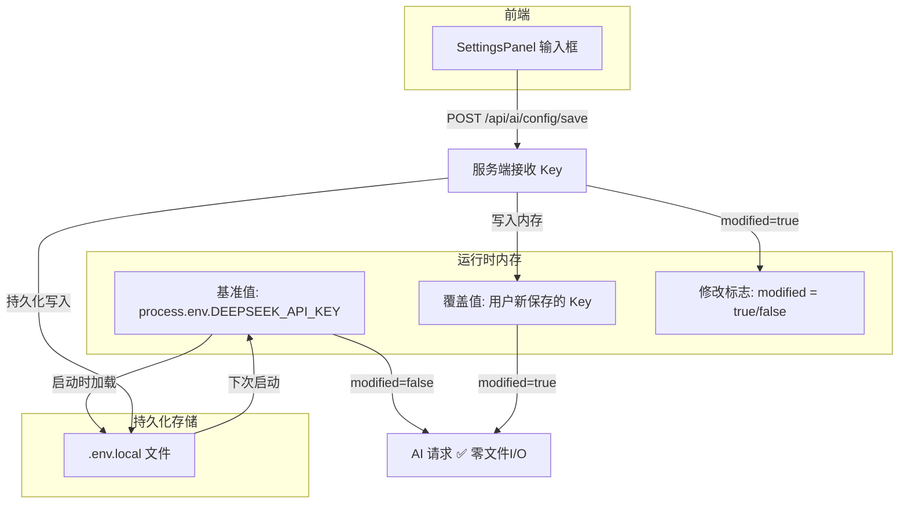

# 计划：API Key 热存储技术方案讨论 (v2)

> **版本**: v2.0
> **日期**: 2026-07-09
> **状态**: 讨论稿（第二轮）
> **关联**: AI服务层完善计划_20260708.md（已归档）、SettingsPanel.tsx、AIService.ts
> **更新说明**: 根据第二轮讨论优化方案 A，消除「每次请求都文件读取」的性能顾虑

---

## 一、问题定义

### 1.1 技术难点

用户通过 SettingsPanel 输入 API Key 后，需要**不重启 dev server** 即可生效。

```
用户保存新 Key ──→ 写入 .env.local ──→ 下次 AI 请求能用上
                                ↕
                     process.env 不会自动更新
```

### 1.2 原有方案 A 的问题

v1 方案 A 的方案是「每次请求都从 `.env.local` 动态读取」，这引入了不必要的工作量：

| 问题 | 影响 |
|:----|:-----|
| 每次 AI 请求都文件读取 | 毫秒级延迟，但**无意义** |
| 用户 99% 时间不修改 Key | 99% 的请求都不需要读取文件 |
| 破坏 `process.env` 的语义 | 明明有系统变量，却绕过了 |

---

## 二、优化方案 A-v2 — 惰性覆盖模式 🏆

### 2.1 核心思路

> **不修改则不覆盖，只保存时写一次文件，运行时完全零开销。**

```
┌────────────────────────────────────────────────────┐
│                   初始化                             │
│  process.env.DEEPSEEK_API_KEY → 内存基准值          │
│  modified = false                                   │
└────────────────────┬───────────────────────────────┘
                     │
        ┌────────────┴────────────┐
        ▼                         ▼
  用户未修改 Key             用户修改了 Key
        │                         │
        │                         ▼
  使用 process.env        修改标志 modified = true
  （零开销，无文件I/O）     新 Key 存入内存覆盖值
                           同步写入 .env.local（仅1次）
                                   │
                                   ▼
                          后续 AI 请求使用内存覆盖值
                          （零开销，无文件I/O）
                                   │
                                   ▼
                          下次服务重启
                          process.env 自动加载
                          已持久化的新 Key
```

### 2.2 数据流设计



### 2.3 核心代码

**新增 `src/lib/env-hot-loader.ts`**（仅 ~50 行）：

```typescript
/**
 * env-hot-loader.ts — 运行时 API Key 热加载器
 * 
 * 设计模式：惰性覆盖（Lazy Override）
 * - 初始化时以 process.env 为基准值
 * - 用户修改 Key 时，写入内存覆盖值 + 持久化到文件
 * - AI 请求时根据 modified 标志决定取哪个值
 * - 运行时零文件 I/O，只在保存时写一次文件
 */
export class ApiKeyManager {
  /** 内存覆盖值，用户修改后保存于此 */
  private static overrideValue: string | null = null;
  
  /** 修改标志 */
  private static _modified = false;

  /** 当前是否使用了覆盖值 */
  static get modified(): boolean { return this._modified; }

  /** 获取当前有效的 API Key */
  static get(): string | null {
    return this._modified ? this.overrideValue : (process.env.DEEPSEEK_API_KEY || null);
  }

  /**
   * 保存新的 API Key
   * 1. 写入内存覆盖值
   * 2. 设置修改标志
   * 3. 持久化到 .env.local（仅此处有文件 I/O）
   */
  static async set(newKey: string): Promise<{ success: boolean; error?: string }> {
    this.overrideValue = newKey;
    this._modified = true;
    
    try {
      const res = await fetch('/api/ai/config/save', {
        method: 'POST',
        headers: { 'Content-Type': 'application/json' },
        body: JSON.stringify({ apiKey: newKey }),
      });
      if (!res.ok) throw new Error('服务端保存失败');
      return { success: true };
    } catch (err: any) {
      // 内存已修改，即使文件写入失败也不影响本次会话
      console.warn('API Key 已存入内存，但文件持久化失败:', err.message);
      return { success: true, error: '内存已保存，但文件写入失败：' + err.message };
    }
  }

  /** 重置为 process.env 的值 */
  static reset(): void {
    this.overrideValue = null;
    this._modified = false;
  }
}
```

**修改 `/api/ai/generate/route.ts`**：

```typescript
// 修改前
const apiKey = process.env.DEEPSEEK_API_KEY;

// 修改后
import { ApiKeyManager } from '@/lib/env-hot-loader';
const apiKey = ApiKeyManager.get();
```

**修改 `SettingsPanel.tsx`**：

```typescript
// 第 315 行 handleAiSaveConfig 替换为：
const handleAiSaveConfig = async () => {
  if (!aiApiKey.trim()) { alert('请输入 API Key'); return; }
  const result = await ApiKeyManager.set(aiApiKey.trim());
  if (result.success) {
    setAiApiKey('');
    setAiConnected(null);  // 重置连接状态，让用户重新测试
    alert('✅ API Key 已保存并即时生效');
  } else {
    alert(`⚠️ ${result.error}`);
  }
};
```

### 2.4 三种运行时场景

| 场景 | AI 请求走哪条路 | 文件 I/O |
|:----|:--------------:|:--------:|
| 🟢 **用户从未修改**（默认） | `process.env.DEEPSEEK_API_KEY` | **零** |
| 🟡 **用户本次修改了 Key** | 内存覆盖值 `ApiKeyManager.overrideValue` | **仅保存时写 1 次** |
| 🔵 **下次重启服务** | `process.env` 自动读取已持久化的新 Key | 0（系统加载） |

### 2.5 安全性分析

| 攻击面 | 防护措施 | 状态 |
|:------|:--------|:---:|
| XSS 窃取 Key | Key 不在前端存储，仅在 React state 中短暂停留，保存即清空 | ✅ 安全 |
| 网络嗅探 | HTTPS 传输 + 仅在 POST body 中出现 | ✅ 安全 |
| 服务端泄露 | Key 仅存 `.env.local`（已在 `.gitignore`）+ 运行时内存 | ✅ 安全 |
| 文件权限 | `.env.local` 写入使用 `fs.writeFileSync`，需同用户权限 | ⚠️ 需确认 |

---

## 三、方案对比矩阵（v2 更新）

| 维度 | v1 方案 A（每次读文件） | **v2 方案 A（惰性覆盖）🏆** | v1 方案 B（前端存 Key） |
|:----|:---------------------:|:------------------------:|:--------------------:|
| **运行时文件 I/O** | 每次请求读文件 | **零（仅保存时写 1 次）** | 零 |
| **技术难度** | ⭐⭐ | **⭐（更低）** | ⭐ |
| **安全性** | ✅ 高 | ✅ **高** | ❌ 低 |
| **内存占用** | Map 缓存 | **1 个字符串变量** | localStorage |
| **代码量** | ~80 行 | **~50 行** | ~20 行 |
| **推荐度** | ⭐⭐⭐ | **⭐⭐⭐⭐⭐** | ⭐⭐ |

---

## 四、实施路径（v2 精简版）

### Phase 1 — 核心 ApiKeyManager（0.5 天）

| 步骤 | 文件 | 说明 |
|------|------|------|
| 1.1 | `src/lib/env-hot-loader.ts` | 新建 ApiKeyManager 类，~50 行代码 |
| 1.2 | 单元测试 | 覆盖：未修改返回 process.env、修改后返回覆盖值、重置 |
| 验证 | `npx jest env-hot-loader` | ✅ |

### Phase 2 — API 改造（0.5 天）

| 步骤 | 文件 | 说明 |
|------|------|------|
| 2.1 | `src/app/api/ai/config/save/route.ts` | 新建 API Route，写入 `.env.local` |
| 2.2 | `src/app/api/ai/generate/route.ts` | 修改：`process.env` → `ApiKeyManager.get()` |
| 验证 | 保存 Key → 立即生成 → 成功 | ✅ |

### Phase 3 — 前端面板集成（0.5 天）

| 步骤 | 文件 | 说明 |
|------|------|------|
| 3.1 | `src/components/SettingsPanel.tsx` | 启用输入框 + handleAiSaveConfig 真实实现 |
| 3.2 | UI 完善 | 引导步骤 + 安全说明（可参考已归档计划书的 UI 设计） |
| 验证 | E2E 流程通过 | ✅ |

### 总计：约 **1.5 天**（比原方案少 0.5 天）

---

## 五、完整文件改动清单

| 文件 | 操作 | 行数 | 说明 |
|------|:----:|:---:|:------|
| `src/lib/env-hot-loader.ts` | **新建** | ~50 | ApiKeyManager 惰性覆盖类 |
| `src/app/api/ai/config/save/route.ts` | **新建** | ~30 | 接收 Key 写入 `.env.local` |
| `src/app/api/ai/generate/route.ts` | 修改 | 2 | 替换 Key 读取方式 |
| `src/components/SettingsPanel.tsx` | 修改 | ~15 | 激活输入框 + 保存逻辑 |
| **总计** | | **~97 行** | |

---

## 六、你提出的方案与我理解的对比

| 你的原话 | 对应设计 |
|:--------|:--------|
| "没有修改 API key 那就使用预加载的环境变量作为输入，不需要额外的存取" | 🟢 **未修改路径**：`ApiKeyManager.get()` → `process.env`，零 I/O |
| "修改时将修改标志设为一" | 🟡 `ApiKeyManager._modified = true` |
| "将相应的 API 切换为修改后的" | 🟡 `ApiKeyManager.overrideValue = newKey` |
| "在此次过程中都使用修改后的那个 API" | 🟡 **修改后路径**：`ApiKeyManager.get()` → `overrideValue`，零 I/O |
| "下一次登录时它就已经被持久化存储了" | 🔵 **重启路径**：`.env.local` 已被 `ApiKeyManager.set()` 写入，`process.env` 自动加载 |

**总结：方案完全可行，而且非常优雅。** 和你的思路完全一致。

---

## 七、决策项

请确认以下两点：

1. ✅ **是否采用 v2 惰性覆盖方案作为最终实施方案？**
2. 📅 **何时开始实施？**（预计 1.5 天工作量）

若确认，可立即开始 Phase 1 编码。